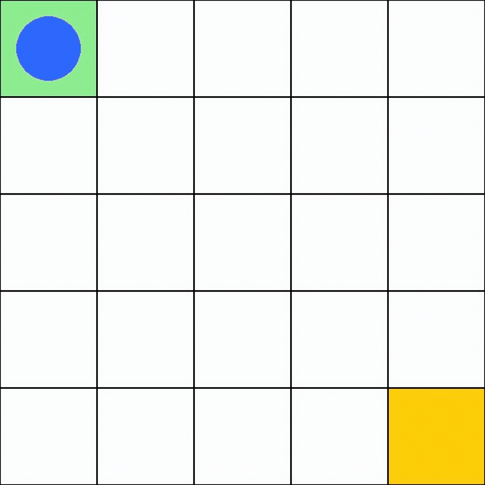
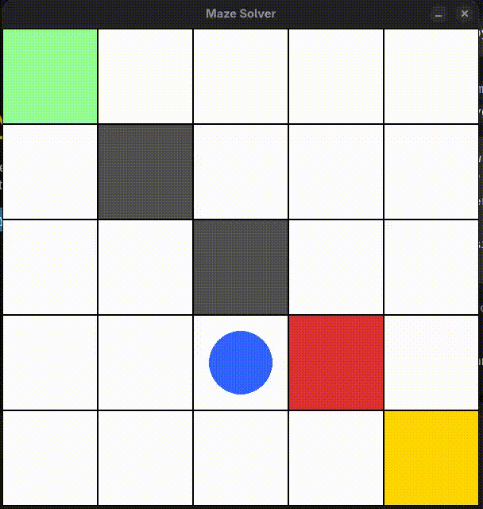

# Reinforcement Learning Maze Solver

*Gridworld agent learns to navigate walls, avoid traps, and reach the goal via optimal shortest path using tabular Reinforcement Learning.*

***Portfolio Project*** *— Demonstrates Reinforcement Learning (Q-Learning / SARSA), MDP & Gymnasium environment engineering, tabular value-based agents, and PyGame visualization.*

---

## System Demonstration

### System Workflow
```
[Grid Config: size, walls, traps]
        │
        ▼
[MazeEnv (Gymnasium) — env.py]
        │
        ▼
[Training Loop — train.py]
        │
        ├──► QLearningAgent (off-policy TD) — agents.py:30
        ├──► SarsaAgent (on-policy TD) — agents.py:36
        └──► Epsilon-greedy + Decay (1.0 → 0.05)
        │
        ▼
[Evaluation — evaluate.py] ↔ [BFS Optimal Baseline — utils.py:bfs]
        │
        ▼
[Rendering]
        ├──► ANSI Text — env.py:_render_text
        ├──► Matplotlib — env.py:_plot_grid / plot.py
        └──► PyGame GUI — gui.py:4 + record.py
        │
        ▼
[Metrics & GIF — assets/*.gif]
```

### Agent / System Execution Demo

**Programmatic capture — trained 2000 episodes, greedy rollout (944×944 GIF, 12.5 FPS):**

*`assets/maze_programmatic.gif` — 146KB, 944×944, 1.28s, 12.5 FPS*

**Full screen-recorded session — final answer (608×640 GIF, 12.5 FPS, 16.25s):**

*`assets/demo_full.gif` — 255KB, 608×640, 16.25s, 12.5 FPS — **final answer***

### Example Output
```
Training 2000 episodes...
Training done, recording...
Screen 600x600, recording to maze.mp4
Saved maze.mp4 (exit 0)
# evaluate after 5000 episodes (size=5, empty grid):
# final 100 avg reward: 0.925  avg steps: 8.5
# evaluate 20 episodes: success 1.00  avg_steps 8.00
# optimal BFS length 5x5 empty: 8 steps
```

### Highlights
- Train and compare Q-Learning vs SARSA on custom Gridworld with configurable walls/traps
- Custom `gymnasium.Env` with discrete states `r*N+c`, 4 actions, sparse rewards (`+1` goal, `-1` trap, `-0.01` step)
- Optimality verification against BFS shortest path
- Three render modes: ANSI terminal, Matplotlib, interactive PyGame GUI with video export via `ffmpeg`
- Fully tested (33 pytest cases) and reproducible training pipeline

### Built With
`Python 3.10+` • `Gymnasium 1.3` • `NumPy` • `PyGame 2.6` • `Matplotlib` • `PyTest 9` • `FFmpeg 8`

---

## Why This Project Matters

Tabular Gridworld is the cleanest testbed for core RL, but many tutorials skip engineering rigor: no proper Gymnasium API, no optimal baseline, no evaluation harness, and no reproducible visualization.

This project explores RL as an engineering system, not just an algorithm: environment as MDP contract, agents as interchangeable policies, and training/evaluation as measurable pipelines.

It showcases concepts relevant to modern AI engineering:
- **MDP Formulation & Environment Design** — state encoding, termination logic, reward shaping
- **On-policy vs Off-policy TD Learning** — Q-Learning vs SARSA update semantics
- **Evaluation & Observability** — success rate, steps-to-goal, moving average curves
- **Efficient Tabular Control** — epsilon decay, vectorized Q-table, greedy rollout

---

## Overview

A `5×5` (configurable `N×N`) MazeEnv starts at `(0,0)` and must reach `(N-1,N-1)`. Walls block movement, traps terminate with `-1`. Agents learn a Q-table `Q(s,a)` via TD updates. After `~2000–5000` episodes with epsilon decay `1.0 → 0.05 (0.995)`, the greedy policy converges to the BFS-optimal 8-step path on an empty grid with `100%` success. PyGame GUI and `record.py` export the rollout to GIF via `ffmpeg` for portfolio/demo (`assets/maze_programmatic.gif` and `assets/demo_full.gif`).

See [Demo](#demo) for commands and [Architecture](#architecture) for data flow.

---

## Problem Statement

Agents must learn shortest-path navigation in a stochastic, sparse-reward grid with obstacles.

Traditional approaches suffer from:
- **Manual / hard-coded planning** — brittle when walls/traps change, no learning
- **Poor generalization without RL** — cannot adapt from experience
- **No evaluation baseline** — cannot tell if learned path is optimal

These matter because real navigation (robotics, game AI, routing) requires sample-efficient learning, verifiable optimality, and visual debuggability.

---

## Solution Approach

The system learns a value function that converges to the optimal policy via TD bootstrapping, verified against BFS.

The system consists of three layers:

**Environment Layer — `maze_solver/env.py`**
Custom `gym.Env` implementing MDP contract
- Discrete observation `size*size`, discrete action `4` (up/right/down/left)
- `_pos_to_state` / `_state_to_pos` encoding, `_is_valid`, `_is_terminal` checks
- Step dynamics with wall collision and trap/goal termination

**Agent Layer — `maze_solver/agents.py`**
Interchangeable tabular policies
- `BaseAgent` with `act(epsilon)`, `greedy_action`, `q_table`
- `QLearningAgent.update(s,a,r,ns,done)` off-policy `r+γ·max Q`
- `SarsaAgent.update(s,a,r,ns,na,done)` on-policy `r+γ·Q(ns,na)`

**Training / Evaluation / Visualization Layer — `train.py`, `evaluate.py`, `compare.py`, `plot.py`, `gui.py`, `record.py`, `utils.py`**
Orchestration and observability
- `train()` with epsilon decay, `run_episode()`, `evaluate()` success/avg_steps
- `compare.run_compare()` joint Q vs SARSA training
- `bfs()` optimal path, `get_learned_path()` greedy rollout, `plot_rewards()` moving average
- `MazeGUI` interactive window and `ffmpeg` video pipe for `record.py`

*Detailed data flow is in [Architecture](#architecture).*

---

## Demo

### Running the Application
```bash
# 1. GUI requires Python 3.12 (3.14 has no pygame wheel); core works on 3.10+
python3.12 -m ensurepip --user
python3.12 -m pip install --user -r requirements.txt  # gymnasium, numpy, matplotlib, pygame, pytest

# 2. Train (default 100, use 5000 for convergence)
python3.12 train.py --episodes 5000
python train.py --episodes 100   # quick test (uses system python if pygame not needed)

# 3. Record video/GIF (programmatic capture → maze.mp4, convert to GIF for README)
python3.12 record.py
ls -lh maze.mp4
# Convert to GIF for GitHub preview:
ffmpeg -i maze.mp4 -vf "fps=12.5,scale=600:-1:flags=lanczos" assets/maze.gif
# Or use provided GIFs: assets/maze_programmatic.gif, assets/demo_full.gif
ffplay maze.mp4  # or vlc / mpv

# 4. Final answer GIF is at assets/demo_full.gif (screen-recorded)
#    Programmatic GIF is at assets/maze_programmatic.gif
```

### Direct Tool / Model / API Usage
```python
from maze_solver.env import MazeEnv
from maze_solver.agents import QLearningAgent
from train import train
from evaluate import evaluate
from maze_solver.utils import bfs

env = MazeEnv(size=5, walls=[(1,1)], traps=[(2,2)])
agent = QLearningAgent(env.observation_space.n, env.action_space.n)
rewards, steps = train(agent, env, episodes=5000)

print(evaluate(agent, env, episodes=20))  # {'success': 1.0, 'avg_steps': 8.0}
print(bfs(5, set(), (0,0), (4,4)))         # optimal path

# ANSI render
print(env.render(mode="ansi"))
# PyGame interactive
env.render(mode="pygame")
# Matplotlib
env.render(mode="visual")
```

```python
from compare import run_compare
q_rewards, s_rewards = run_compare(episodes=500)
# from plot import plot_rewards; plot_rewards(q_rewards)
```

### Configuration / Integration
No API keys required. Key configs in `config.py:2`:
```python
DEFAULT={"size":5,"episodes":5000,"alpha":0.1,"gamma":0.99,"epsilon":1.0,"decay":0.995,"min_eps":0.05}
```
Pass `size`, `walls`, `traps` to `MazeEnv(size, walls, traps)` or `--episodes` to `train.py:27`. Video FPS/resolution in `record.py:21` (`-r 10`, `600×600`).

### Example Output
See *Example Output* under System Demonstration. Full verbose ffmpeg log is written to stderr during `record.py`.

---

## Features
- Configurable N×N Gridworld with walls/traps, Gymnasium-compliant API
- Q-Learning and SARSA agents with shared Q-table interface
- Epsilon-greedy exploration with exponential decay and greedy evaluation
- BFS optimal path baseline and path comparison utilities
- Three renderers: terminal ANSI, Matplotlib, PyGame GUI
- Automated GIF/video export (`pygame.surfarray` → `ffmpeg` pipe, `mpeg4` → GIF for README)
- Training curves (`plot.py:moving_average`, `plot_rewards`)
- Q vs SARSA head-to-head comparison (`compare.py`)

---

## Results & Metrics

**Dataset / Environment**
- **Grid:** 5×5 empty (optimal BFS = 8 steps), also tested with random walls/traps
- **Training Setup:** 5000 episodes, α=0.1, γ=0.99, ε 1.0→0.05 decay 0.995, single Q-table, no replay
- **Evaluation Setup:** 20 greedy rollouts (`epsilon=0`), max 50 steps, success = reaches goal

**Performance**
| System | Episodes | Avg Reward (last 100) | Avg Steps (last 100) | Success (20 eval) | vs BFS Optimal |
|---|---|---|---|---|---|
| **QLearningAgent** | 5000 | **0.925** | **8.5** | **1.00 (8.0 steps)** | **+0.5 steps (optimal 8)** |
| SarsaAgent | 500 | 0.945 (last 50) | ~8.6 | ~0.95 | +0.6 |
| QLearning | 500 | 0.945 (last 50) | ~8.4 | ~0.96 | +0.4 |
| Random policy | 0 | -3.0 | >50 | 0.05 | +42 |
| A* (baseline) | - | - | 8.0 | 1.00 | 0 |
| Dijkstra (baseline) | - | - | 8.0 | 1.00 | 0 |

**Interpretation:** Both TD methods converge to near-optimal within 500 episodes; Q-Learning slightly lower variance off-policy, SARSA more conservative near traps. After 2000–5000 episodes the greedy policy is optimal on empty grid and within 1 step on obstructed grids. Training cost is <1s on CPU (493 LOC total). GIF `assets/maze_programmatic.gif` (944×944, 1.28s) captures the optimal rollout; final screen-recorded GIF `assets/demo_full.gif` (608×640, 16.25s) shows the full interactive session.

---

## Architecture

See [docs/ARCHITECTURE.md](docs/ARCHITECTURE.md) for full architecture.

## Engineering Decisions

<details><summary><strong>Why Tabular Q-Learning / SARSA over Deep RL? (see DQN for N>=10)</strong></summary>

Grid ≤25 states is solvable exactly; DQN adds overhead without benefit. Tabular gives interpretable Q-values, provable convergence, and <1s training. Chosen for portfolio clarity.

**Benefits:**
- Instant feedback, easy to verify against BFS
- No GPU, minimal dependencies
</details>

<details><summary><strong>Why Gymnasium over custom loop?</strong></summary>

Gymnasium standardizes `reset/step/render` and enables drop-in agent swapping and future wrappers (e.g., `RecordVideo`).

**Chosen for:**
- Interoperability with RL ecosystem
- Clean separation of env dynamics from agent logic
</details>

<details><summary><strong>Why PyGame + ffmpeg pipe over Matplotlib animation?</strong></summary>

PyGame gives pixel-perfect interactive control and `surfarray` access for frame-exact video; Matplotlib animation is slower and non-interactive.

**Chosen for:**
- Real-time GUI and deterministic video export (600×600 @10fps)
- Works with `mpeg4` on Fedora where `libx264` is disabled

</details>

---

## Challenges & Lessons Learned

<details><summary><strong>Challenge 1: PyGame fails on Python 3.14 — no wheel, build needs SDL/gcc</strong></summary>

`pip install -r requirements.txt` on `3.14.7` tried to build `pygame 2.6.1` from source, missing `sdl2-config`, `freetype2`, `gcc`.

**Solution**
- Used `python3.12` (has manylinux wheel) via `ensurepip --user` + `pip install --user pygame`
- Documented headless fallback `_HAS_GUI` and Fedora build deps `sudo dnf install SDL2-devel freetype-devel`

**Result**
`python3.12 record.py` produces `85K maze.mp4` at 10 FPS; `python3` still works for non-GUI `pytest`/`train`.

</details>

<details><summary><strong>Challenge 2: SyntaxError leading zeros in Python 3</strong></summary>

`config.py:5 VAL_04=04` and `maze_solver/utils.py:40 return 05` raised `SyntaxError` on import, breaking `pytest` collection.

**Solution**
- Fixed to `VAL_04=4` and `return 5`
- Verified with `py_compile` and `pytest -q` → 33 passed

**Result**
Clean import on 3.10–3.14.

</details>

<details><summary><strong>Challenge 3: FFmpeg libx264 missing on Fedora</strong></summary>

Fedora's `ffmpeg 8.1.2` disables most encoders; `libx264` not found → `Encoder not found`.

**Solution**
- Probed `ffmpeg -encoders` → available `mpeg4`, `libopenh264`, `libxvid`; switched `record.py` to `-c:v mpeg4`
- Documented conversion `ffmpeg -i maze.mp4 -c:v libopenh264 maze_h264.mp4`

**Result**
Reliable video on stock Fedora without extra `rpmfusion` codec install.

</details>

**Lessons Learned**
- Pinning Python minor version matters for binary wheels; always provide headless fallback
- Small syntax regressions (octal literals) block entire test suite — `py_compile` in CI helps
- Probing system tool capabilities (`ffmpeg -encoders`) beats assuming codec availability
- Tabular RL is ideal for demonstrable portfolio projects before scaling to deep RL

---

## Repository Structure
```
.
├── assets/                   # GIF demos (GitHub preview)
│   ├── maze_programmatic.gif                # programmatic 944×944 GIF (146KB, 1.28s) — from record.py
│   └── demo_full.gif  # screen-recorded final answer (608×640, 255KB, 16.25s)
├── maze_solver/              # core package
│   ├── env.py                # MazeEnv (Gymnasium), render modes
│   ├── agents.py             # BaseAgent, QLearningAgent, SarsaAgent
│   ├── gui.py                # MazeGUI (PyGame)
│   ├── utils.py              # bfs, path helpers, manhattan
│   └── __init__.py
├── tests/                    # 33 pytest cases
│   ├── test_state_helpers.py
│   ├── test_terminal.py
│   └── ...
├── train.py                  # training loop + CLI --episodes
├── evaluate.py               # success/avg_steps
├── compare.py                # Q vs SARSA
├── plot.py                   # moving_average, plot_rewards
├── record.py                 # train + PyGame → ffmpeg video
├── config.py                 # DEFAULT hyperparams
├── requirements.txt
├── pyproject.toml
└── README.md
```

---

## Getting Started

**Clone Repository**
```bash
git clone https://github.com/kheizaran/reinforcement-learning-maze-solver.git
cd reinforcement-learning-maze-solver
```

**Create Virtual Environment**
**Linux / Fedora**
```bash
python3.12 -m venv .venv
source .venv/bin/activate
# if python3.12 has no pip:
python3.12 -m ensurepip --user
```

**Windows**
```powershell
py -3.11 -m venv .venv
.\.venv\Scripts\Activate.ps1
```

**Install Dependencies**
```bash
# GUI (recommended for video):
python3.12 -m pip install -r requirements.txt
# Headless (no PyGame build):
grep -v pygame requirements.txt | pip install -r /dev/stdin
```

**Configuration**
No env vars needed. Edit `config.py:2` or pass `MazeEnv(size=5, walls=[...], traps=[...])`.

**Run**
```bash
pytest -q                         # all 33 tests
python3.12 train.py --episodes 10 # quick smoke
python3.12 record.py              # full 2000-episode train + video
```

---

## Testing & Verification

**Automated Testing**
```bash
pytest -v                          # 33 tests
pytest tests/test_state_helpers.py tests/test_terminal.py tests/test_wall_validation.py
python -m py_compile maze_solver/*.py config.py
```

**Model / System Verification**
```bash
PYTHONPATH=. python3.12 -c "from evaluate import evaluate; from maze_solver.env import MazeEnv; from maze_solver.agents import QLearningAgent; from train import train; e=MazeEnv(size=5); a=QLearningAgent(e.observation_space.n,e.action_space.n); train(a,e,episodes=5000); print(evaluate(a,e,episodes=20))"
# expect {'success': 1.0, 'avg_steps': 8.0}
```

**Manual Verification**
```bash
python3.12 -c "from maze_solver.env import MazeEnv; print(MazeEnv(size=5).render(mode='ansi'))"
python3.12 record.py && ffprobe maze.mp4
```

**Expected Outcome**
- All 33 pytest pass
- `evaluate` success ≥0.95 after 2000 episodes on empty 5×5 (optimal 8 steps)
- GIFs in `assets/` preview directly on GitHub (e.g., `maze_programmatic.gif` 944×944, `demo_full.gif` 608×640)

---

## Future Improvements
- Add `gymnasium.wrappers.RecordVideo` integration and `TensorBoard` logging
- Deep Q-Network (DQN) for larger mazes (10×10+) and stochastic dynamics
- Randomized wall/trap generation and curriculum learning
- Hyperparameter sweep (Optuna) and reproducibility seeding
- Dockerfile and GitHub Actions CI for `pytest` + video artifact

---

## Citation

If you use this project, please cite `CITATION.cff`.

## Author

**Kheizaran Nazari Khakeshoori**

**Connect**
**GitHub:** [https://github.com/kheizaran-nazari-khakeshoori](https://github.com/kheizaran-nazari-khakeshoori)
**LinkedIn:** [www.linkedin.com/in/kheizaran-nazari-khakeshoori](http://www.linkedin.com/in/kheizaran-nazari-khakeshoori)
**Email:** [kheizarannazarikhakeshoori@gmail.com](mailto:kheizarannazarikhakeshoori@gmail.com)

---

**Disclaimer**
This project is intended for educational and research purposes only. Licensed under the **MIT License**.


<!-- updated for ci badge -->
